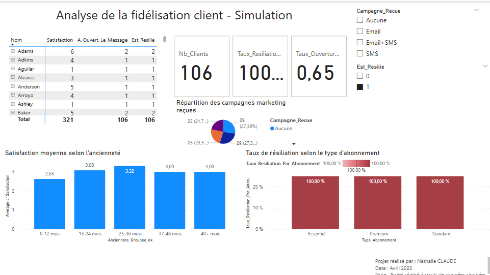
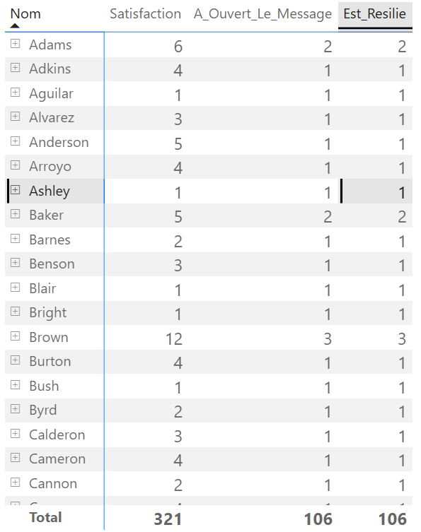

# Analyse de la fidélisation client - Projet Power BI
Ce projet est une simulation d’analyse marketing réalisée avec Power BI. L’objectif est de construire un tableau de bord visuel, interactif et orienté business pour identifier les leviers de fidélisation, repérer les abonnés à risque et mettre en valeur les insights clés.  
Il s’appuie sur un dataset fictif de 500 clients, généré pour reproduire un contexte métier réaliste.

## 🎯 Objectif
- Identifier les profils clients à risque de résiliation,
- Analyser l'impact des campagnes marketing sur la rétention,
- Visualiser la satisfaction en fonction de l'ancienneté.

## 📸 Aperçus du dashboard

### 🔹 Vue d’ensemble

### 🔹 Détail : Table des clients à risque

➡️ [📄 Télécharger le dashboard complet en PDF](./Dashboard_Analyse_Fidelisation_Clients.pdf)

## 🛠️ Outils utilisés
- Power BI Desktop
- DAX (formules de calcul)
- Données simulées (500 clients)

## 📊 Ce projet contient
- Un dashboard complet avec :
  - KPI Cards
  - Graphique barres (Taux de résiliation par type d'abonnement)
  - Camembert (Campagnes marketing reçues)
  - Histogramme (Satisfaction vs Ancienneté)
  - Matrix (Liste des clients à risque)
- Des filtres interactifs
- Une analyse commentée et structurée

## 📂 Structure du projet
- `dataset_clients_powerbi.csv` : données brutes simulées
- `Dashboard_Analyse_Fidelisation_Clients.pdf` : version PDF du dashboard
- `screenshots/` : captures du dashboard

## 👩‍💻 Auteur
- Nathalie CLAUDE
- Avril 2025

---

⚡ Projet pédagogique - Données 100% simulées avec Python (Faker)
